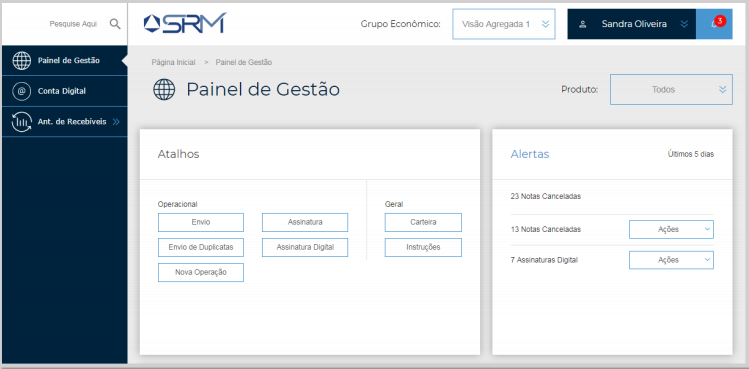

# Portal SRM

## Sobre o projeto
Este projeto foi criado para um processo seletivo de front-end. O framework utilizado é Angular 7.

## Telas
### Protótipo

### Resultado

## Requisitos

Instale o servidor [Node Server](http://nodejs.org/) juntamente com o gerenciador de dependencias [NPM](https://npmjs.org/).
Abaixo estão as versões instaladas que funcionam:

    $ node --version
    v9.6.1

    $ npm --version
    5.6.0

## Começando
Instalando o projeto:

    # Se ainda não tem nenhum repositório local, crie uma pasta, abra-a no terminal e digite o comando abaixo:
    $ git init

    Depois:
    $ git clone https://github.com/leonardomcleite/ang7-srm.git
    $ cd ang7-srm
    $ npm install
    $ npm start

## Recursos Utilizados
Neste projeto foi utilizado:

    Responsividade com mediaQuery (Desktop | Mobile First)
    Tematização e Variaveis com SASS
    Navegação com Angular Routing
    Animação com Angular Animations
    Componentes Padrão do Angular Material
    Serviços
    Reutilização de Código
    